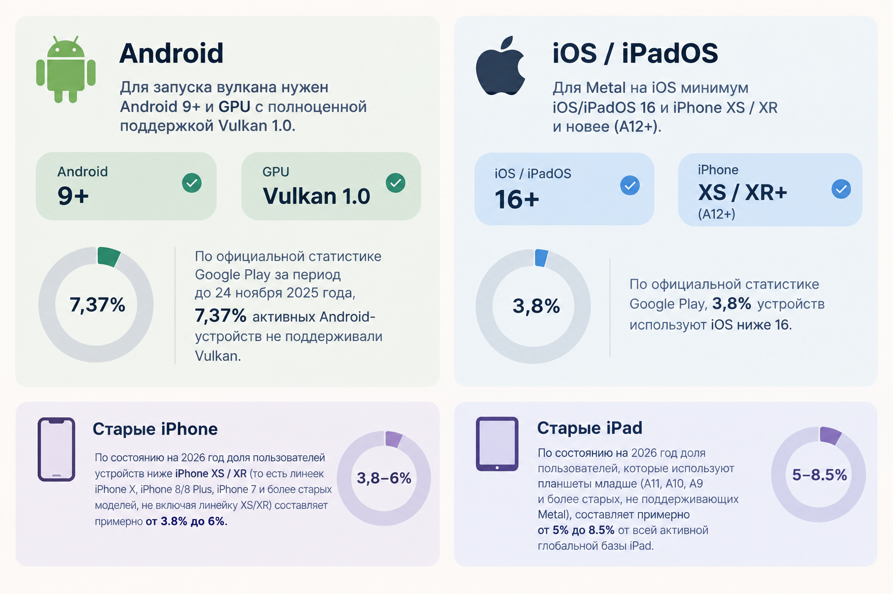
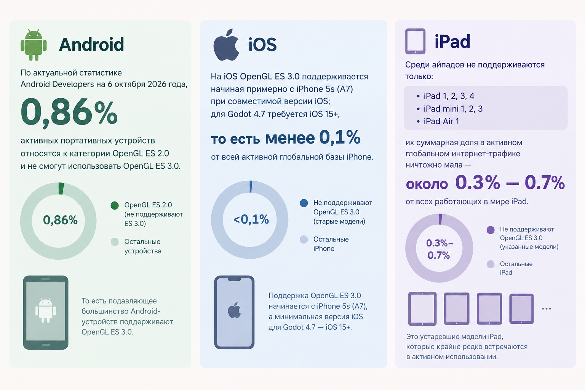

# Вопросы

1. Что используем Vulkan или OpenGL ES 3.0?
   
### При использовании Metal + Vulkan: 

*Ниже то же самое но буквами*

Для запуска вулкана нужен Android 9+(сейчас 17 уже) и GPU с полноценной поддержкой Vulkan 1.0.
По официальной статистике Google Play за период до 24 ноября 2025 года, **7,37%** активных Android-устройств не поддерживали Vulkan.

Для Metal на IOS минимум iOS/iPadOS 16 и  iPhone XS / XR и новее (A12+)
**3,8%** устройств используют iOS ниже 16.  
По состоянию на 2026 год доля пользователей устройств ниже iPhone XS / XR (то есть линеек iPhone X, iPhone 8/8 Plus, iPhone 7 и более старых моделей, не включая линейку XS/XR) составляет примерно **от 3.8% до 6%**
По состоянию на 2026 год доля пользователей, которые используют планшеты младше (то есть устройства на базе процессоров Apple A11, A10, A9 и более старых(то-есть тех что не поддерживают Metal), составляет примерно от **5% до 8.5%** от всей активной глобальной базы iPad.

### При использовании OpenGL ES 3.0

*Ниже то же самое но буквами*

По актуальной статистике Android Developers на 6 октября 2026 года, только **0,86%** активных портативных устройств относятся к категории OpenGL ES 2.0 и не смогут использовать OpenGL ES 3.0.

На IOS OpenGL ES 3.0 поддерживается начиная примерно с iPhone 5s (A7) при совместимой версии iOS; для Godot 4.7 требуется iOS 15+, тоесть **менее 0,1%** от всей активной глобальной базы iPhone.
Среди айпадов не поддерживаются только 
- iPad 1, 2, 3, 4
- iPad mini 1, 2, 3
- iPad Air 1
их суммарная доля в активном глобальном интернет-трафике ничтожно мала —  **около 0.3% — 0.7%** от всех работающих в мире iPad.

### Минусы OpenGL ES 3.0

- HDR 2D: нельзя использовать полноценный HDR-диапазон яркости для света и свечения.
	С HDR: магический шар может быть очень ярким в центре, а вокруг него — мягкое насыщенное свечение. Яркие эффекты лучше сохраняют детали и взаимодействуют со светом.
    Без HDR: яркие значения ограничены обычным диапазоном. При некоторых эффектах свечение может выглядеть менее выразительным или терять детали.
    Но важный нюанс: в Compatibility тоже есть Glow/Bloom! Можно сделать красивый светящийся шар, руны и магические атаки. Просто полноценный HDR-конвейер недоступен.

- MSAA для 2D: нет такого способа сглаживания 2D, как в Mobile.
	сглаживание зубчатых краёв. Например, диагональная линия руны выглядит гладкой, а не как лесенка. Можно обойти рисованием спрайтов в высоком разрешении и аккуратным масштабированием.
	Другие варианты сглаживания для 2D в Godot:
	- FXAA — сглаживает края уже готового изображения. Дёшево, но немного размывает картинку.
    - SSAA / supersampling — рендерить в более высоком разрешении и уменьшать изображение. Качественно, но дороже для GPU.
    - Сглаживание текстур — фильтрация при масштабировании спрайтов.
    - Вручную подготовленные спрайты — рисовать края с антиалиасингом прямо в текстурах.
    - Шейдеры — можно реализовать собственное сглаживание.

- Particle trails: встроенная поддержка следов частиц ограничена.
	  следы за движущимися частицами. Например, за магическим снарядом тянется светящийся хвост. Можно сделать отдельным спрайтом, цепочкой частиц или шейдером.
  
- Debanding: нет встроенного эффекта уменьшения полос на плавных градиентах.
	  убирает заметные полосы на плавных градиентах. Например, вместо плавного фиолетового свечения видны отдельные цветные кольца. Можно добавить лёгкий шум (dithering) в текстуру или шейдер.

- GPU compute: нельзя напрямую выполнять собственные вычисления на GPU через RenderingDevice.
	Скорее всего он нам нахуй не нужен, поскольку у нас будет не больше явно 50 врагов на экране в пике, а это имеет смысл от 300 - 500 и то не всегда.