# Визуальные референсы игр

Подборка примеров визуального стиля для проекта. Оценка сложности — примерная: **1** означает очень небольшой объём и простое исполнение одним художником, **10** — большой объём уникальной графики, анимации и технически сложных эффектов. Помощь второго участника может ускорить подготовку отдельных ассетов, но художественное направление и единообразие всё равно должен держать один человек.

## Card Guardians

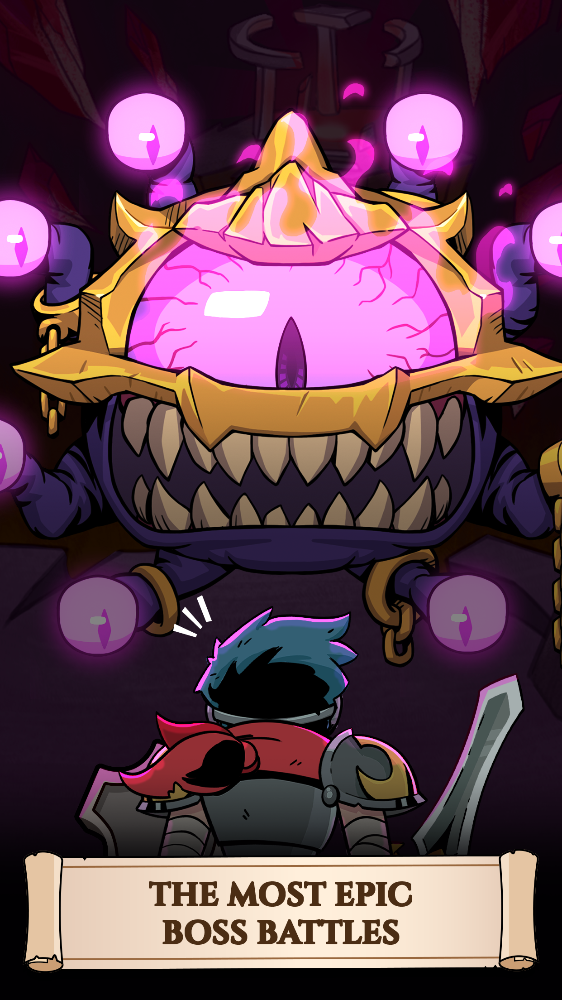
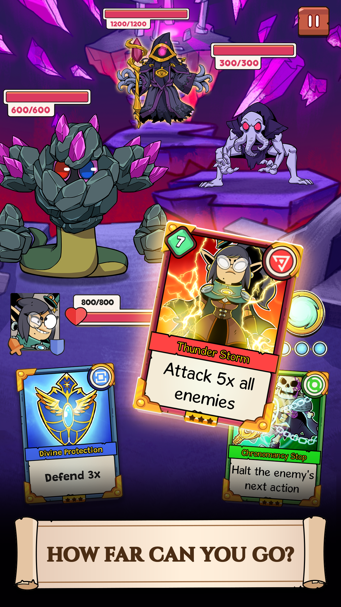
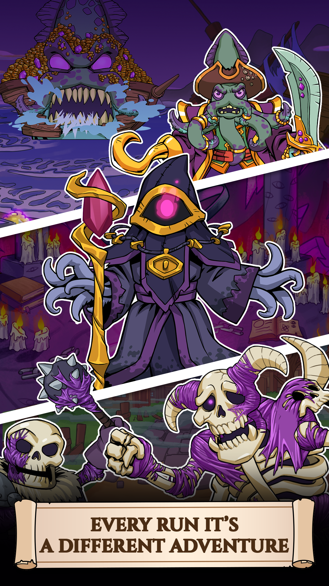

**Стиль.** Яркое фэнтези с округлыми формами, выразительными персонажами и чистыми цветными областями. Карты и интерфейс хорошо отделены от игрового поля, поэтому экран остаётся читаемым даже при большом количестве эффектов. Визуально это аккуратно и дружелюбно, но ассетов много: герои, противники, карты, предметы и анимации должны выглядеть как части одного мира.

**Сложность для одного художника: 7/10.** Отдельный персонаж не слишком детализирован, однако для полноценной игры понадобятся разнообразные иллюстрации карт, врагов, эффектов и окружений. Можно упростить до меньшего числа биомов и переиспользовать основы персонажей.

## Cats & Soup(мой фаворит 1)

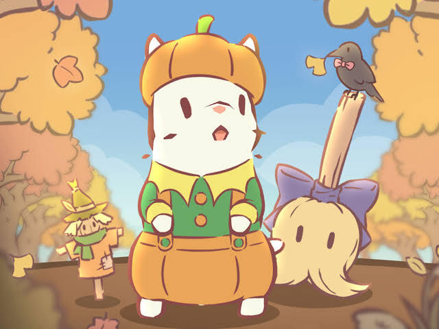
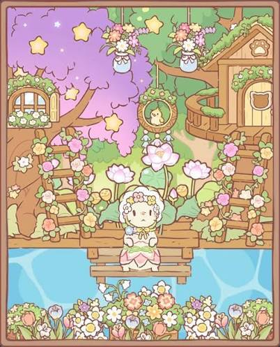
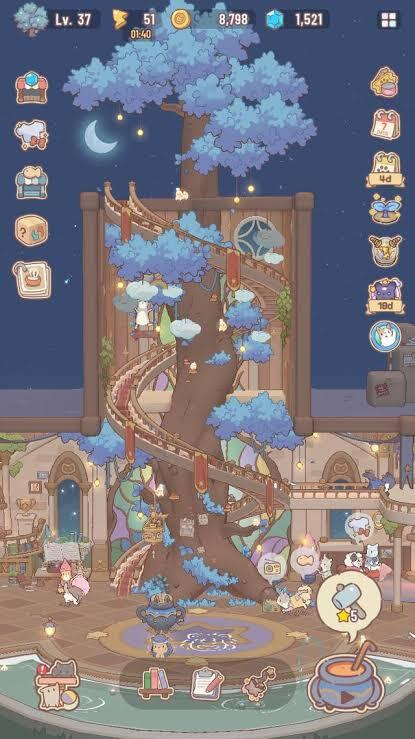

**Стиль.** Мягкий уютный мультяшный вид: простые формы, пастельные цвета, небольшие детали и милые анимационные акценты. Коты и предметы легко различимы, а композиция строится из повторяемых станций и декора. Хороший ориентир для убежища и коллекционирования; боевой части и драматичных сцен в этом стиле почти нет.

**Сложность для одного художника: 4/10.** Базовые объекты можно строить из повторяемых форм и палитры, а анимацию оставить короткой и цикличной. Сложность вырастет, если делать много уникальных котов, одежды, комнат и сезонных украшений.

## Cult of the Lamb

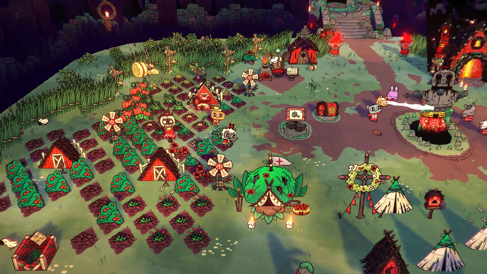
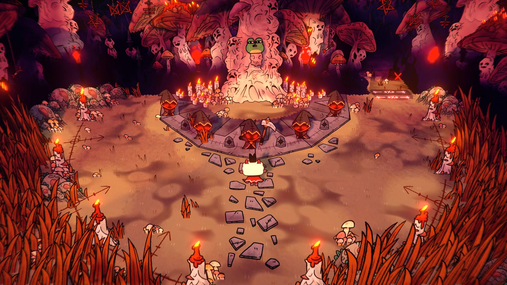
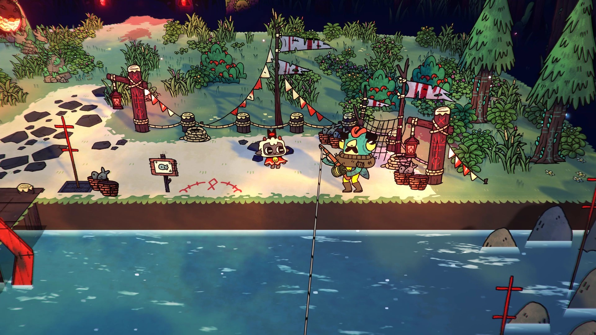

**Стиль.** Контрастная мультяшная сказка с милыми округлыми героями, тёмными контурами и мрачными символами. Простые силуэты сочетаются с детализированными фонами, эффектами и большим набором предметов. Можно взять контраст «милое + мистическое», не повторяя плотность графики оригинала.

**Сложность для одного художника: 8/10.** Упрощённые персонажи выглядят доступно, но игра сочетает бой, поселение, множество врагов, предметов, построек и выразительные эффекты. Реалистичный для маленькой команды вариант — один основной биом, небольшой набор врагов и скромное убежище.

## Dicey Dungeons(мой фаворит 2)

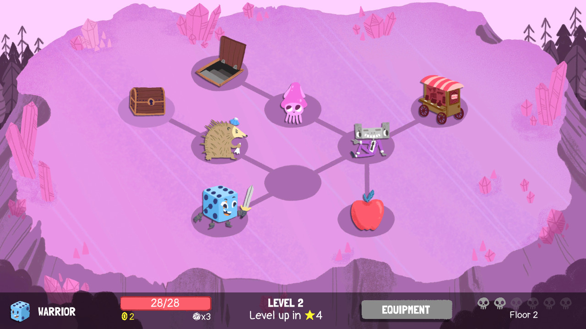
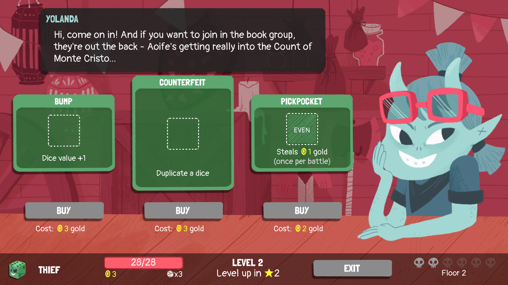
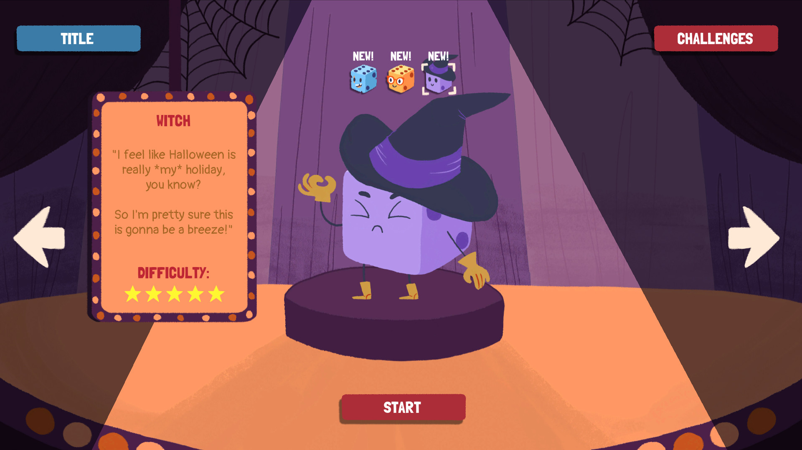

**Стиль.** Плоская графика с толстой чёрной линией, крупными цветными пятнами и нарочито простыми персонажами. Формы предметов и врагов читаются почти как наклейки или рисунки маркером. Визуальная простота помогает быстро понимать поле боя и делает стиль подходящим для небольшой команды.

**Сложность для одного художника: 5/10.** Отдельные рисунки сравнительно просты, а выразительность достигается формой и линией. Основной объём — большое количество уникальных предметов, врагов и состояний; его можно сдержать переиспользованием базовых силуэтов и палитры.

## Good Pizza, Great Pizza

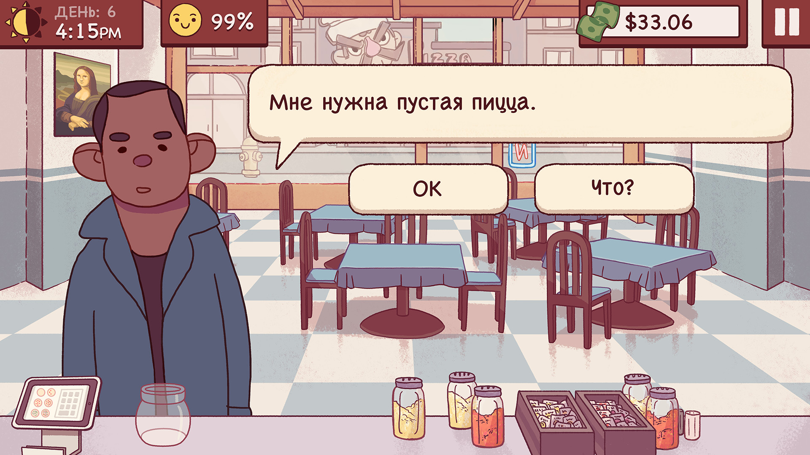
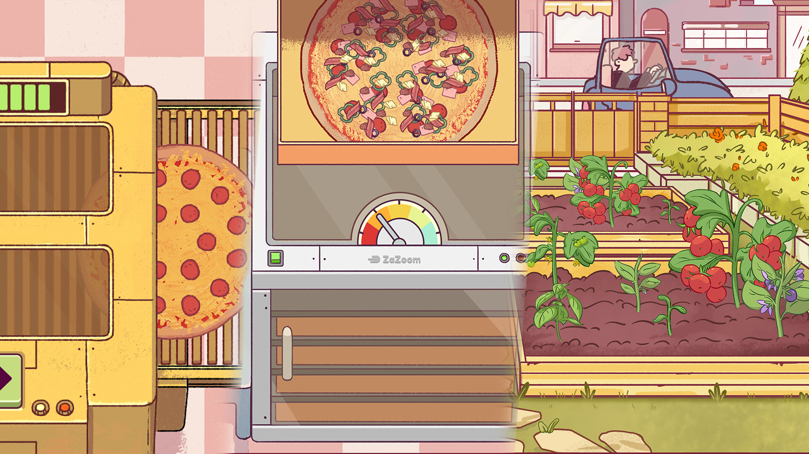
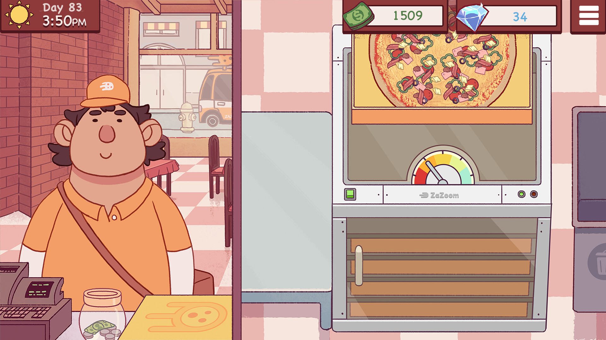

**Стиль.** Плоская рисованная 2D-графика с уверенным контуром, простыми лицами и тёплой палитрой. Персонажи и объекты выглядят как иллюстрации из комикса, а сцены обычно состоят из нескольких крупных элементов. Подходит для портретов клиентов, диалогов и уютного хаба.

**Сложность для одного художника: 4/10.** Рисунки не требуют реалистичной анатомии или сложного света, а базовые элементы можно переиспользовать. Объём растёт из-за множества портретов и выражений, поэтому полезно иметь общий шаблон персонажа и менять волосы, одежду и мимику.

## Moonlighter

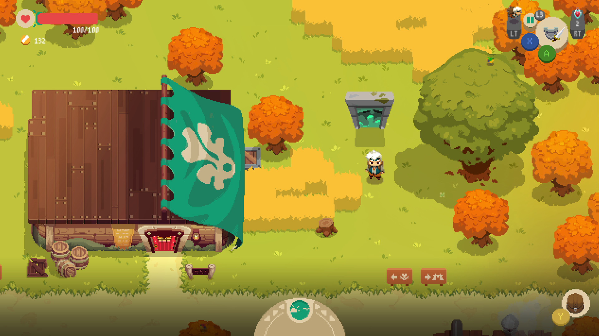
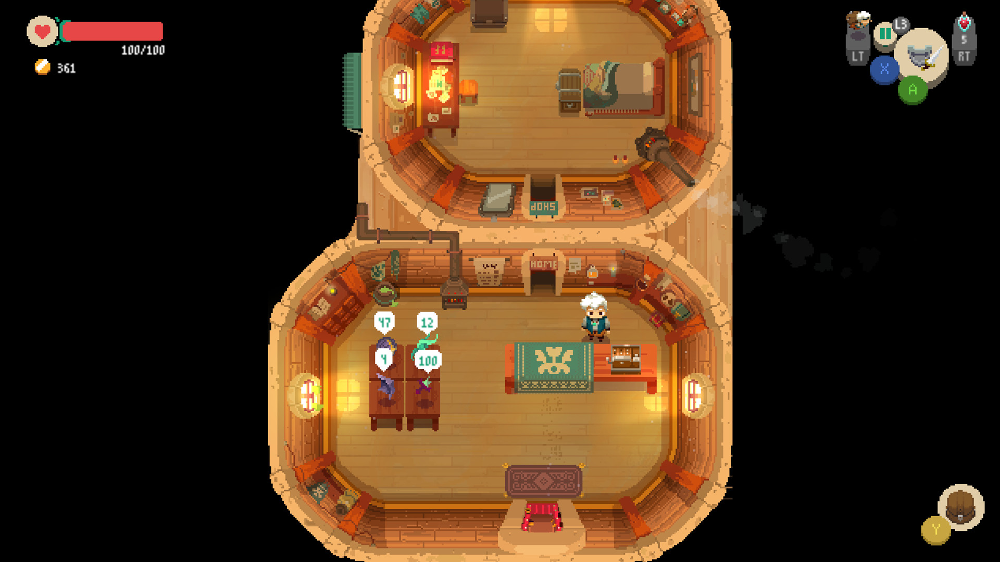
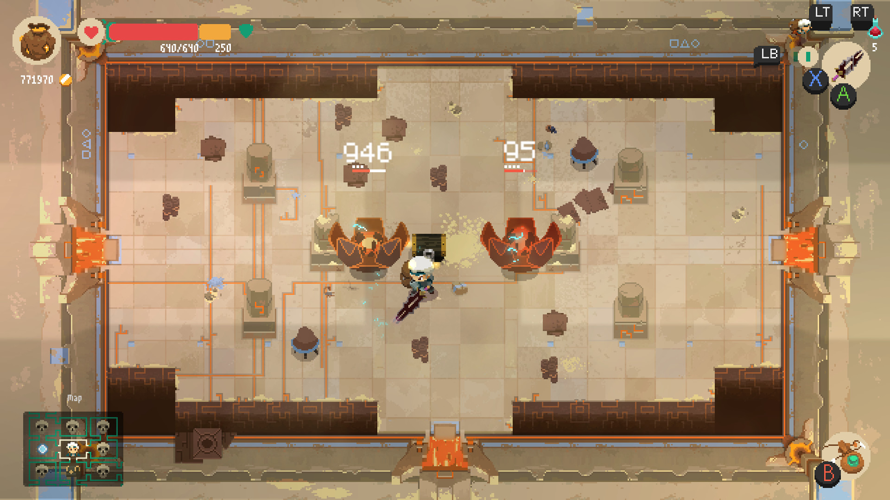

**Стиль.** Детализированный пиксель-арт сверху: маленькие персонажи и тайлы, богатые палитры, выразительное освещение и анимация боя. Кадры хорошо читаются, но это результат строгой работы с пиксельной сеткой и большим количеством тщательно выверенных спрайтов.

**Сложность для одного художника: 9/10.** Для новичка это особенно рискованный референс: нужно не просто рисовать маленькие картинки, но выдерживать размер пикселя, контраст и анимацию на каждом спрайте. Лучше ориентироваться на структуру комнат и вид сверху, а не пытаться повторить качество пиксельной графики.

## Сводная таблица

| Игра | Что полезно взять | Сложность исполнения стиля | Что именно усложняет стиль |
|---|---|---:|---|
| Card Guardians | Читаемые карты и яркое фэнтези | 🟡 5/10 | Нужно выдерживать объёмную мультяшную отрисовку, цветовые переходы и эффекты, сохраняя чёткие силуэты. |
| Cats & Soup | Уютное убежище и коты | 🟢 3/10 | Простые округлые формы и мягкие цвета сравнительно легко повторять; важно держать единый милый характер и аккуратные пропорции. |
| Cult of the Lamb | Контраст милого и мистического | 🔴 7/10 | Стиль строится на точном контрасте света и тени, выразительных силуэтах и сочетании милых форм с мрачными деталями. |
| Dicey Dungeons | Толстый контур и простые формы | 🟡 4/10 | Рисовать формы просто, но нужно последовательно выдерживать характерную линию и добиваться ясной читаемости объектов. |
| Good Pizza, Great Pizza | Портреты и диалоговые сцены | 🟢 3/10 | Плоская заливка и упрощённые лица не требуют сложного рендеринга; главная задача — сохранить единый рисунок линии и пропорций. |
| Moonlighter | Вид сверху и устройство комнат | 🔴 9/10 | Пиксель-арт требует точного контроля сетки, контраста и читаемости каждого спрайта; анимация и эффекты должны попадать в ту же пиксельную манеру. |

**Самые посильные ориентиры для небольшой команды:** простота форм и контура из *Dicey Dungeons*, портреты и тёплая палитра из *Good Pizza, Great Pizza*, уют хаба из *Cats & Soup*. Их можно сочетать в собственный стиль, ограничив число биомов, врагов и вариантов одежды.
